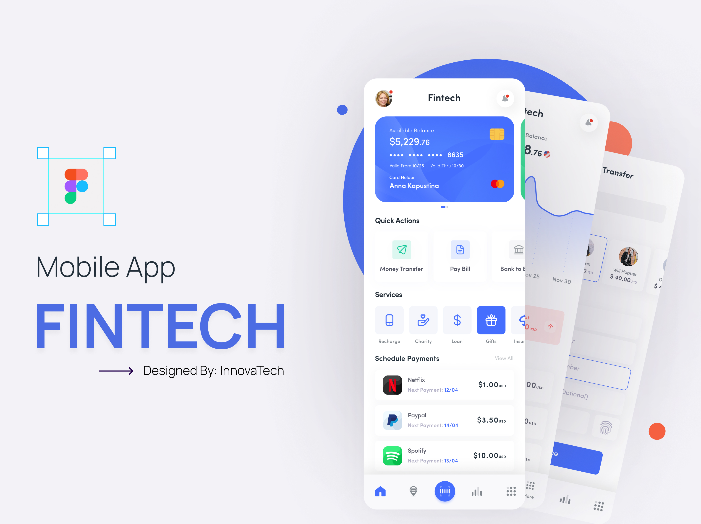

# E-Bank-KMP

E-Bank-KMP is a **banking application** built using **Jetpack Compose Multiplatform (KMP)** for Android & iOS. It leverages the **Decompose framework** for navigation and state management, offering a seamless experience across platforms.



## Features

### Dashboard:
- **Account Balance Overview**
  - Displays available balance and card details.

- **Quick Actions**
  - Money Transfer
  - Bill Payment
  - Bank-to-Bank Transfers

- **Services**
  - Mobile Recharge
  - Charity Donations
  - Loan Management
  - Gift Services

- **Scheduled Payments**
  - Displays upcoming payments (e.g., Netflix subscription).

- **Bottom Navigation Bar**
  - Home
  - Transactions
  - User Profile
  - Analytics
  - More options

## Tech Stack
- **Kotlin Multiplatform** (KMP)
- **Jetpack Compose Multiplatform** for UI
- **Decompose Framework** for navigation and state management
- **Material Design 3** for modern UI components

## Getting Started
1. Clone the repository:
   ```bash
   git clone https://github.com/yourusername/E-Bank-KMP.git
   ```
2. Open in **Android Studio** or **IntelliJ IDEA**.
3. Run the project on an emulator or physical device.

## Contributions
Contributions are welcome! Feel free to open issues or submit pull requests to enhance the project.

## License
This project is licensed under the MIT License - see the LICENSE file for details.